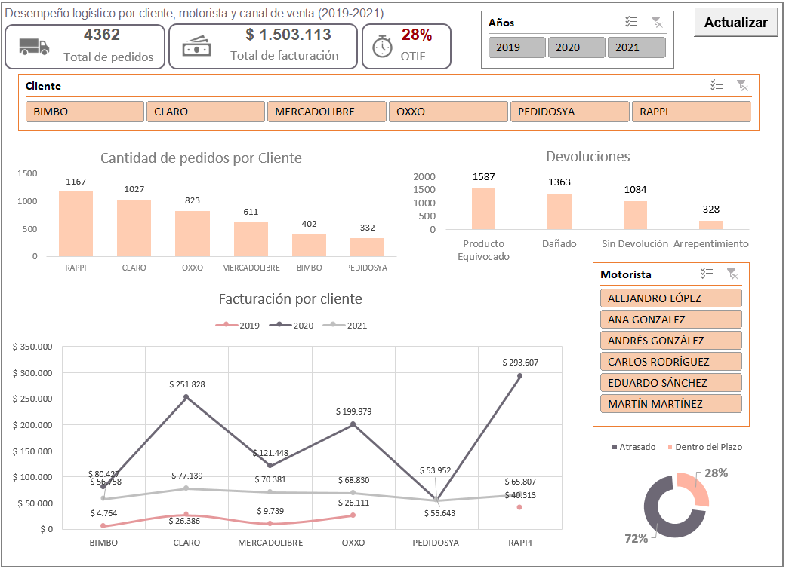

# 📦 Dashboard Logístico en Excel (2019–2021)

Este proyecto fue desarrollado en **Excel 2019** con el objetivo de analizar el desempeño logístico por cliente, motorista y motivo de devolución, utilizando una base de datos ficticia. Es una solución completa que incluye limpieza de datos, análisis dinámico y automatización para facilitar la toma de decisiones basada en datos.

---

## 🎯 Objetivos

- Identificar cuellos de botella logísticos y oportunidades de mejora.
- Visualizar indicadores clave como pedidos, devoluciones, facturación y OTIF.
- Facilitar el seguimiento mensual mediante automatización con macros.

---

## 📁 Archivos del proyecto

| Carpeta       | Contenido                                                                 |
|---------------|---------------------------------------------------------------------------|
| `dataset/`    | Contiene el archivo Excel con las siguientes hojas:                      |
|               | - `datos_crudos`: datos originales sin tratar                            |
|               | - `datos_limpios`: datos normalizados para análisis                      |
|               | - `ejercicio`: tabla resumen con cálculos intermedios                   |
|               | - `datos_para_actualizar`: origen para tablas dinámicas                  |
|               | - `dashboard`: panel visual con KPIs y segmentadores interactivos        |
| `dashboard/`  | Captura del dashboard final en formato PNG                               |
| `video/`      | Video de navegación mostrando cómo se actualiza el dashboard con macros  |

---

## 🛠️ Herramientas utilizadas

- Tablas dinámicas
- Segmentaciones de datos
- Gráficos dinámicos y combinados
- Funciones estadísticas
- Macro con botón "Actualizar" para automatizar actualizaciones

---

## 🔍 Insights destacados

- **Rappi** fue el cliente con más pedidos y facturación, pero también el que más devoluciones generó.
- El indicador **OTIF** (entregas a tiempo y completas) fue solo del **27%**, lo que indica un problema de cumplimiento que requiere revisión de procesos y causas específicas de demoras.
- Las devoluciones más comunes fueron por **producto equivocado** y **productos dañados**, lo que sugiere posibles mejoras en control de calidad.
- En **2021** se observó un pico de facturación que podría estar relacionado con estacionalidad o crecimiento operativo.

---

## ⚙️ Automatización con Macro

Se incorporó un **botón llamado "Actualizar"** que permite actualizar automáticamente todas las tablas dinámicas, gráficos y visualizaciones del dashboard tras cargar nuevos datos. Esto elimina tareas repetitivas y agiliza la entrega de resultados, ideal para reuniones mensuales o reportes ejecutivos.

---

## ▶️ Visualización del proyecto

- 🖼️ Captura del dashboard: [Ver imagen](https://drive.google.com/file/d/1htT7G8iI18H4098mkuwK3SfwzZkSRAa0/view?usp=drive_link)
- 📂 Dataset Excel: [Descargar](https://drive.google.com/file/d/1OroZw4tCp0S1DX3iEOKyyf9cxS9Uv-0h/view?usp=drive_link)
- 🎥 Video demostración: [Ver video](https://drive.google.com/file/d/1-OMV0jt1DdkUVeNNQ4fD6KKQ6DkVVEz9/view?usp=drive_link)

---

## 📊 Otros proyectos disponibles

También podés encontrar dashboards de otras áreas como **ventas** y **producción** en mi perfil de GitHub:  
🔗 [https://github.com/romina-abud?tab=repositories](https://github.com/romina-abud?tab=repositories)

---

## 🤝 Conectemos

¿Tenés un proyecto similar? ¿Querés intercambiar ideas o trabajar en equipo?  
Estoy abierta a nuevas oportunidades y colaboraciones.  

📩 [Mi perfil de LinkedIn](https://www.linkedin.com/in/romina-abud/)  
📧 romina.abud@gmail.com
